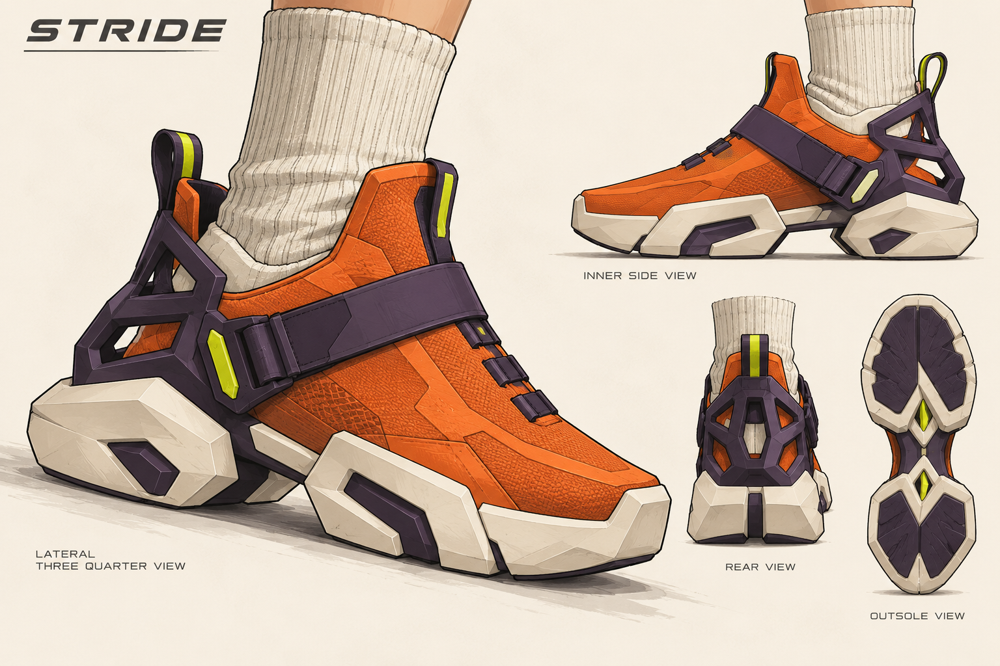
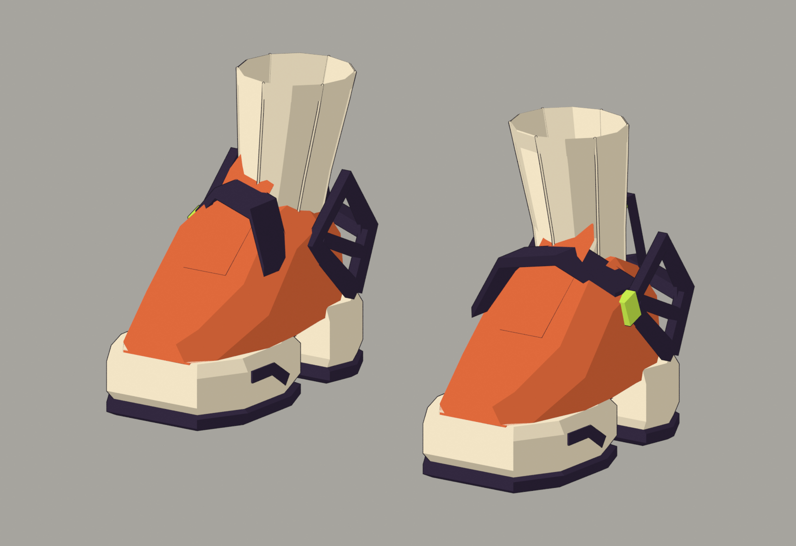
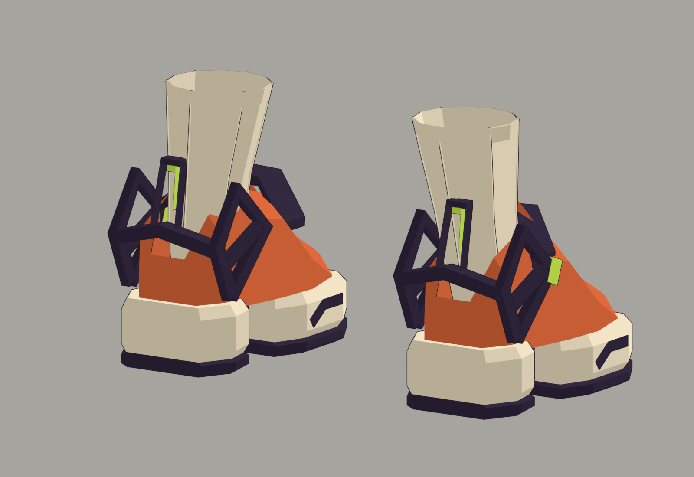
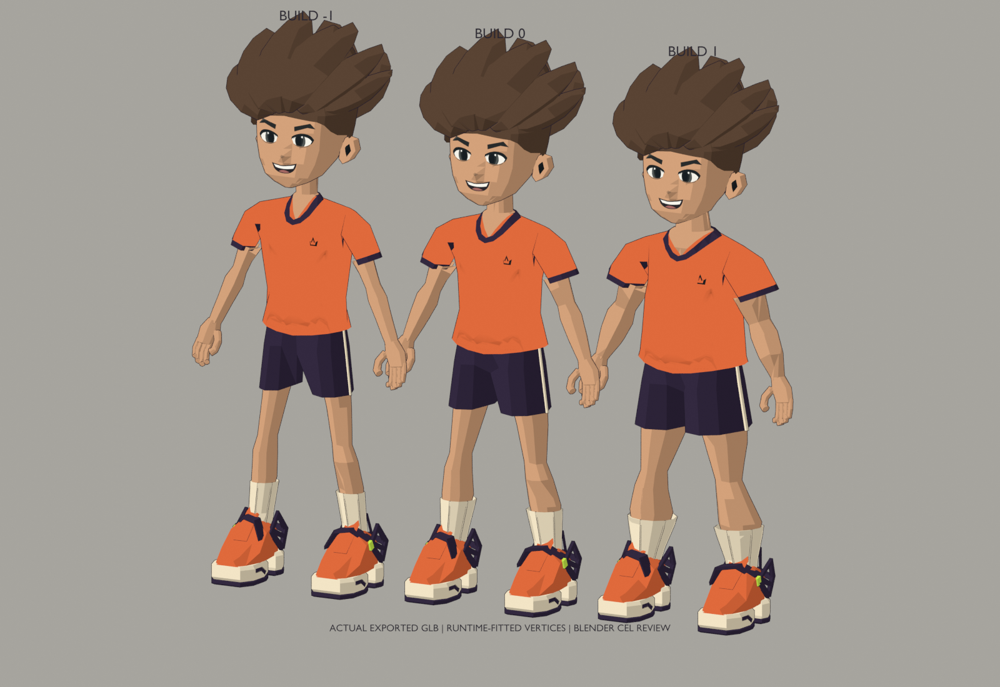
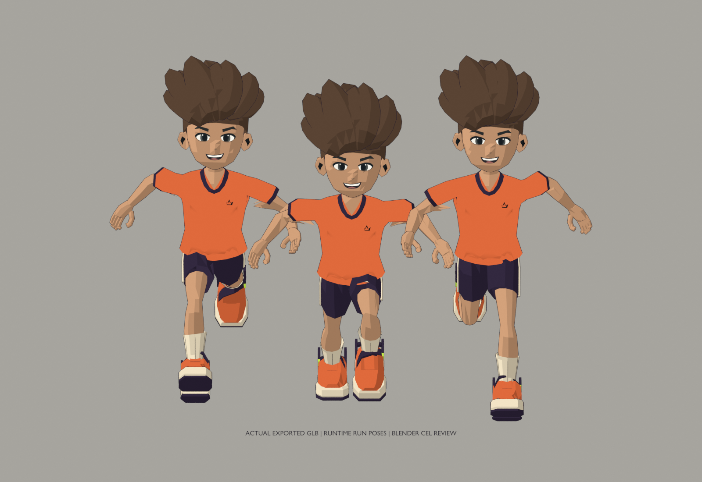
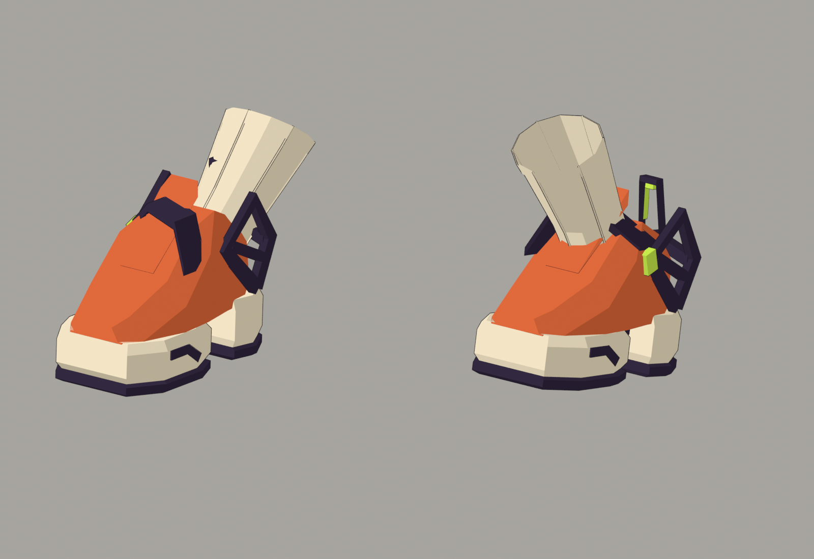

# Stride: articulated split-sole footwear

`shoes-stride` is an original independent shoe selection for the SHIFT capsule. It keeps the existing `athlete-reference-v2` rig and common body-volume field. It does not replace any existing shoe or alter the legacy catalog, runtime, coverage contract, palette channels or saved recipe structure.

## Design and actual geometry

The silhouette has a broad clipped toe, separate chamfered heel and forefoot sole blocks, a narrow raised waist with a real negative-space arch, a diagonal offset instep strap, open side heel cages, a rear bridge/pull loop and a shin-following crew sock. The cage openings, sole gap, buckle, inset and ribs are mesh geometry. This is a new model, not a recolor or a concept image pasted into a scene.

The four existing color channels are `primary`, `secondary`, `trim` and `accent`. The source preview uses orange, midnight violet, ivory and a small lime signal; the runtime can recolor the same geometry. No textures or animations are embedded in the footwear GLB.

- **Exported pair:** 1,648 source triangles, 136,924 bytes, four material primitives
- **SHA-256:** `b087a54980a4db92dc193e4d01f35089df49d4678e89de279a2b847475266102`
- **Attachment:** `ref2_shoes-stride__root` → `root`
- **Coverage:** `feet`, exactly as the existing shoes
- **Skin:** the existing 16 named socket bones and exact catalog rest positions; each vertex is influenced only by its own side's foot and/or shin

## Concept, source and provenance



The concept was generated first with the built-in OpenAI image generation tool. [Exact prompt](references/stride/prompt.txt), [generation provenance and image hash](references/stride/provenance.json). The generated drawing is inspiration only. All model geometry was authored separately, with no image-to-mesh conversion or copied game assets.

- [Isolated authoring script](../assets/source/stride_footwear.py)
- [Editable Blender scene](../assets/source/stride-footwear.blend)
- [Per-piece descriptor](../public/capsule/parts/shoes-stride.json)
- [Shipped GLB](../public/capsule/models/shoes-stride.glb)
- [Source component audit](evidence/stride/source-audit.json)

The script loads only the established mesh/export helper definitions and the exact rig sockets from the legacy catalog. Its dedicated scene and output paths belong to this piece. It never rebuilds previous assets. It exports first, then retains editable mesh geometry, palette materials, armature and vertex groups in the `.blend` scene.

Authoring, export and review used Blender 4.3.2's Python interface in the cloud VM. These are not claims of interactive hand-sculpting or a successful local browser session.

## Fit and animation

Rigid components remain foot-bound. The sock uses the established smooth world-Y 0.105–0.19 m foot-to-shin transition, matching the anatomy. Upper sock/cuff vertices are fully shin-bound. The cuff diameter was increased after the first visual pass to leave measured clearance around the wider calf. There are no per-weight or per-gait variants.

[Runtime validation](evidence/stride/runtime-validation.json) loads the actual exported GLB through `AvatarLibrary`:

- Three builds: −1, 0 and 1
- Five explicit ankle angles: −0.8, −0.35, 0, 0.6 and 1.0 radians, with separate left/right shin rotations
- 492 upper-cuff and 636 outsole vertices per build follow their anatomical owner to floating-point precision; 96 sampled vertices contain the intended ankle blend
- 363 running frames total check finite positions and triangle-edge continuity
- 80 / 84 / 86 calf triangle-centroid samples, checked at rest and five running frames per build; minimum measured shell clearance is approximately 1.79 / 2.78 / 4.28 mm
- Both existing capsule tops with Pulse pack assemble at all three builds with the heaviest source-triangle choice in the remaining slots
- The unchanged 14,000-triangle / 1.5 MB / 12-part appearance budgets are enforced; this shoe has fewer triangles than the existing high shoe
- Existing capsule recipes validate unchanged; the original legacy catalog and original capsule descriptor array are untouched

The Blender review script rebuilds the exact runtime-evaluated world-space vertices from the exported assets after fitting and skinning. It applies a separate illustrative Blender cel material and ink treatment. The face and jersey use their original embedded texture pixels. The Blender images are actual model evidence, not WebGL screenshots.







## Reproduce

```sh
blender -b --python assets/source/stride_footwear.py
node scripts/build-capsule-catalog.mjs
STRIDE_EVIDENCE=1 node --import tsx --test tests/stride-footwear.test.ts
blender -b --python assets/source/stride_review.py
npm run format:check
npm run typecheck
npm test
npm run build
npx playwright test --config playwright.stride.config.ts
```

The runtime snapshot intermediate is written under ignored `outputs/stride/`; it is not a shipped asset. The compact validation JSON and the images are retained. The capsule catalog is derived by the common builder and is intentionally not edited in this change.

## Browser qualification and limits

[Dedicated browser test](../tests/stride-browser/stride.spec.ts) and [CI workflow](../.github/workflows/stride.yml) exercise real shoe selection, unchanged other selections, a rendered thumbnail, three builds, running side/rear views, saved-look reload and old-recipe reimport. They write clearly named `browser-*.png` screenshots and a browser validation report. The workflow uploads them in `stride-footwear-browser-evidence`.

Local Chromium sandbox launch and the cloud-browser loopback route are blocked in this environment. Those restrictions were not bypassed. Browser qualification runs on the repository CI route; check the PR's exact-head workflow results for current status. Until its artifact is inspected, the Blender evidence must not be described as browser qualification.

This is deliberately angular low-poly footwear, not a cloth simulation. The fit check samples calf triangle centroids and selected running poses, not all triangle interiors or all possible motions. The rigid heel cage can intersect deeply flexed fabric at extreme poses outside the measured samples. Arbitrary future pants, cloth collision, every emote and full-room phone performance remain separate qualification work.
